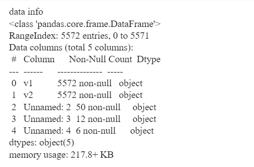
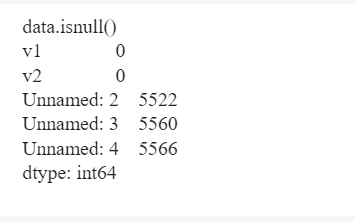

# Implementation-of-SVM-For-Spam-Mail-Detection

## AIM:
To write a program to implement the SVM For Spam Mail Detection.

## Equipments Required:
1. Hardware – PCs
2. Anaconda – Python 3.7 Installation / Jupyter notebook

## Algorithm
1. Import the necessary packages.
2. Read the given csv file and display the few contents of the data.
3. Assign the features for x and y respectively.
4. Split the x and y sets into train and test sets.
5. Convert the Alphabetical data to numeric using CountVectorizer.
6. Predict the number of spam in the data using SVC (C-Support Vector Classification) method of SVM (Support vector machine) in sklearn library.
7. Find the accuracy of the model.


## Program:
```
/*
Program to implement the SVM For Spam Mail Detection..
Developed by: AFZARATHAGSIN.JS
RegisterNumber: 212221040006 


import chardet
file='/content/spam (1).csv'
with open(file, 'rb') as rawdata:
    result = chardet.detect(rawdata.read(10000))
result

import pandas as pd
data=pd.read_csv("/content/spam (1).csv",encoding="windows-1252")

print("Data Head ")
data.head()

print("data info")
data.info()

print("data.isnull()")
data.isnull().sum()

x=data["v1"].values

y=data["v2"].values

from sklearn.model_selection import train_test_split
x_train,x_test,y_train,y_test=train_test_split(x,y,test_size=0.2,random_state=0)


from sklearn.feature_extraction.text import CountVectorizer 
cv=CountVectorizer()

x_train=cv.fit_transform(x_train)
x_test=cv.transform(x_test)

from sklearn.svm import SVC
svc=SVC()
svc.fit(x_train,y_train)

y_pred=svc.predict(x_test)
print("y_pred")
y_pred


from sklearn import metrics
accuracy=metrics.accuracy_score(y_test,y_pred)
print("accuracy")
accuracy


*/
```

## Output:







## Result:
Thus the program to implement the SVM For Spam Mail Detection is written and verified using python programming.
